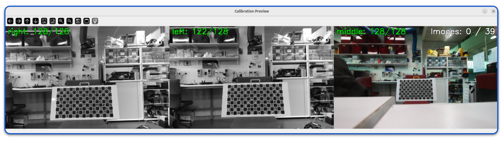
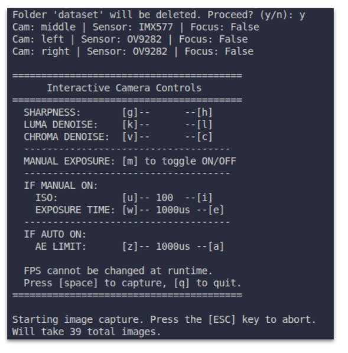
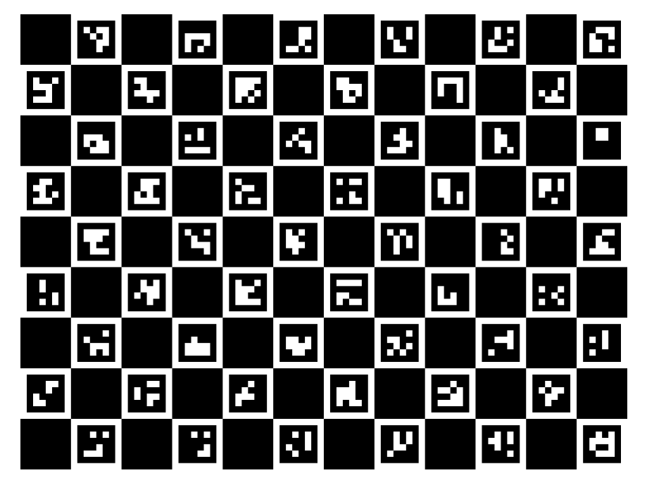
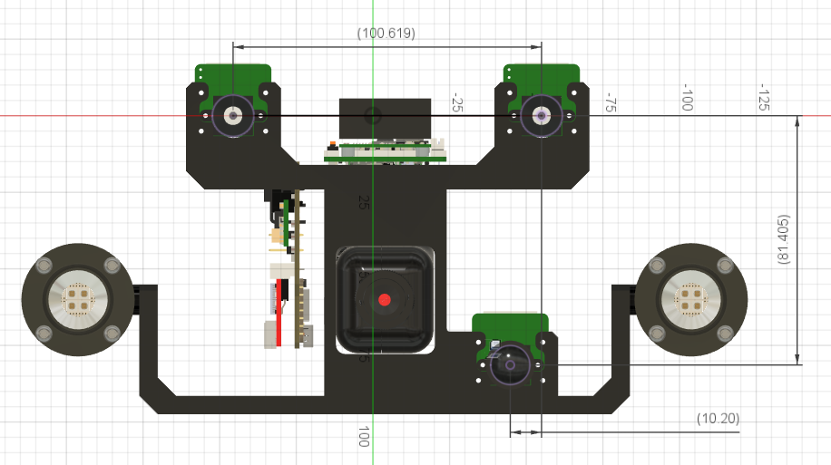
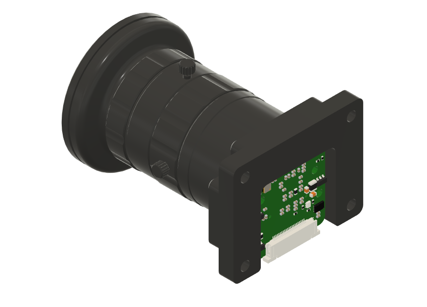

# DepthAI V3 Camera Calibration

Calibration script for OAK cameras using the DepthAI V3 API. Updated from the [DepthAI V2 calibration tools](https://github.com/luxonis/depthai-core/tree/main/examples/python/Calibration) to work with the V3 pipeline architecture.

Tested with the OAK-FFC-3P board. Other OAK boards may require adjustments to the board config JSON.




## Installation

### 1. Set up DepthAI

```bash
git clone https://github.com/luxonis/depthai-core.git && cd depthai-core
python3 -m venv venv
source venv/bin/activate
python3 examples/python/install_requirements.py
```

### 2. Add the calibration scripts

Clone the calibration repository and copy its contents into the existing `Calibration` folder:

```bash
git clone https://github.com/roboticsmick/calibration_depthai_v3.git
cp -r calibration_depthai_v3/* examples/python/Calibration/
rm -rf calibration_depthai_v3
```

This adds the following files alongside the existing Luxonis calibration utilities:

| File | Description |
|------|-------------|
| `calibrate_depthai_v3.py` | Main calibration script (V3 API) |
| `generate_charuco_board.py` | ChArUco board generator |
| `depthai_calibration/` | Helper modules (calibration_utils, epipolar tests, etc.) |
| `OAK-FFC-3P-HQ113.json` | Example board config for OAK-FFC-3P with stereo + RGB |

## Step 1: Generate a ChArUco Board

Generate a printable calibration board:


```bash
python3 generate_charuco_board.py -s 4.0 -nx 12 -ny 9
```

This outputs both a PNG and a PDF file.

### Parameters

| Flag | Description | Default |
|------|-------------|---------|
| `-nx` | Number of squares in X direction | 11 |
| `-ny` | Number of squares in Y direction | 8 |
| `-s` | Square size in cm | (required) |
| `-ms` | Marker size in cm | 75% of square size |
| `-o` | Output filename | Auto-generated |

### Example

```bash
# 17x9 board with 4cm squares and 3cm markers, saved as charuco_board.pdf
python3 generate_charuco_board.py -nx 17 -ny 9 -s 4.0 -ms 3.0 -o charuco_board.pdf
```



### Printing

1. Open the PDF and print at **100% scale** (do not scale to fit page)
2. Measure a printed square with a ruler — it should match your `-s` value exactly
3. If the measured size differs, use the **measured** size when running calibration
4. Mount the board on a flat, rigid surface (cardboard, foam board, etc.)

## Step 2: Create a Board Config JSON

The board config defines your camera layout, sensor models, and stereo pair. Create a `.json` file in the `Calibration` folder.

### Stereo + RGB example (OAK-FFC-3P)

Two OV9282 mono cameras and one IMX577 color camera json setup. An example file is saved in the assets folder of this repository.



```json
{
    "board_config":
    {
        "name": "OAK-FFC-3P",
        "revision": "R3M0E3",
        "cameras":{
            "CAM_C": {
  "model":"OV9282",
                "name": "right",
                "hfov": 75,
                "type": "mono",
                "extrinsics": {
                    "to_cam": "CAM_B",
                    "specTranslation": {
                        "x": 10.0619,
                        "y": 0,
                        "z": 0
                    },
                    "rotation":{
                        "r": 0,
                        "p": 0,
                        "y": 0
                    }
                }
            },
            "CAM_B": {
  "model":"OV9282",
                "name": "left",
                "hfov": 75,
                "type": "mono",
                "extrinsics": {
                    "to_cam": "CAM_A",
                    "specTranslation": {
                        "x": -1.02,
                        "y": -8.1405,
                        "z": 0
                    },
                    "rotation":{
                        "r": 0,
                        "p": 0,
                        "y": 0
                    }
                }
            },
            "CAM_A": {
  "model": "IMX577",
                "name": "middle",
                "hfov": 113,
                "type": "color"
            }

        },
        "stereo_config":{
            "left_cam": "CAM_B",
            "right_cam": "CAM_C"
        }
    }
}
```

### RGB-only example

Single IMX577 color camera json setup.



```json
{
    "board_config": {
        "name": "OAK-FFC-3P-RGB-ONLY",
        "revision": "R3M0E3",
        "cameras": {
            "CAM_A": {
                "model": "IMX577",
                "name": "middle",
                "hfov": 83.6,
                "type": "color"
            }
        }
    }
}
```

### Config fields

| Field | Description |
|-------|-------------|
| `model` | Sensor model (`OV9782`, `IMX577`, `IMX378`, `IMX214`, `AR0234`, etc.) |
| `name` | Camera name used for display and dataset folder naming |
| `hfov` | Horizontal field of view in degrees |
| `type` | `"mono"` or `"color"` |
| `extrinsics.to_cam` | The camera socket this camera's extrinsics are defined relative to |
| `extrinsics.specTranslation` | Approximate translation (cm) between cameras from the board spec |
| `stereo_config` | Defines which cameras form the stereo pair |

## Step 3: Run Calibration

### Basic usage

```bash
python3 calibrate_depthai_v3.py -s <square_size_cm> -brd <board_config.json> -nx <squares_x> -ny <squares_y>
```

### Examples

```bash
# Full calibration with SSH-friendly preview (recommended for remote sessions)
python3 calibrate_depthai_v3.py -s 4.0 -brd OAK-FFC-3P-HQ113.json -nx 12 -ny 9 --ssh-preview

# Full calibration with marker overlay preview
python3 calibrate_depthai_v3.py -s 4.0 -brd OAK-FFC-3P-HQ113.json -nx 12 -ny 9

# Stereo cameras only (disable RGB)
python3 calibrate_depthai_v3.py -s 4.0 -brd OAK-FFC-3P-HQ113.json -nx 12 -ny 9 -dsb middle

# RGB camera only (disable stereo pair)
python3 calibrate_depthai_v3.py -s 4.0 -brd OAK-FFC-3P-HQ113.json -nx 12 -ny 9 -dsb left right
```

### Key parameters

| Flag | Description | Default |
|------|-------------|---------|
| `-s` | Square size in cm (use measured size from printed board) | (required) |
| `-brd` | Path to board config JSON file | (required) |
| `-nx` | Number of ChArUco squares in X | 11 |
| `-ny` | Number of ChArUco squares in Y | 8 |
| `-ms` | Marker size in cm | 75% of square size |
| `-c` | Number of images per polygon position | 3 |
| `--ssh-preview` | Low-bandwidth preview showing marker counts only | off |
| `-dsb` | Disable specific cameras by name (e.g., `-dsb middle`) | none |
| `-fps` | Camera framerate | 10 |
| `-ab` | Anti-banding mode: `off`, `50`, `60` (Hz) | 50 |
| `-ep` | Maximum epipolar error threshold | 0.8 |
| `-osf` | Output display scale factor | 0.5 |
| `-cd` | Delay (seconds) between pressing capture and taking the image | 2 |
| `-dst` | Path to dataset folder for saving captured images | `dataset` |
| `-m` | Mode: `capture`, `process`, or both | `capture process` |
| `-rlp` | Manual lens position per camera (e.g., `-rlp middle=135`) | auto |
| `-fac` | Write to factory calibration | off |
| `-scp` | Save calibration JSON to a custom path | none |

### Capture workflow

1. The script opens a preview window showing all enabled cameras
2. Each camera displays `name: detected/total` corner counts
3. Green text = enough corners detected; red = insufficient
4. Press **spacebar** to capture (after a countdown delay)
5. The script captures synchronized frames from all cameras
6. Repeat until all images are captured
7. Processing runs automatically after capture

### Interactive camera controls during capture

| Key | Action |
|-----|--------|
| `Space` | Capture image |
| `s` | Stop capturing early, begin processing |
| `q` / `Esc` | Quit |
| `g` / `h` | Decrease / increase sharpness (0-4) |
| `k` / `l` | Decrease / increase luma denoise (0-4) |
| `v` / `c` | Decrease / increase chroma denoise (0-4) |
| `m` | Toggle manual / auto exposure |
| `u` / `i` | Decrease / increase ISO (manual mode, 100-1600) |
| `w` / `e` | Decrease / increase exposure time (manual mode) |
| `z` / `a` | Decrease / increase auto-exposure limit (auto mode) |

## Step 4: Process Saved Images

If you've already captured images, you can re-run just the processing step on the saved dataset:

```bash
python3 calibrate_depthai_v3.py -s 4.0 -brd OAK-FFC-3P-HQ113.json -nx 12 -ny 9 -m process
```

This expects a dataset folder structure like:

```text
Calibration/
├── calibrate_depthai_v3.py
├── dataset/
│   ├── left/
│   ├── right/
│   └── middle/
├── depthai_calibration/
│   ├── calibration_utils.py
│   ├── dynamic_recalibration.py
│   ├── epipolar_test_online.py
│   └── reproject_error_fisheye.py
└── OAK-FFC-3P-HQ113.json
```

## Calibration Quality

The script checks calibration quality using two metrics:

- **Reprojection error**: Should be < 1.0 for mono cameras (scaled by resolution). The RGB/middle camera allows up to 3.0 due to higher resolution.
- **Epipolar error**: Should be < 0.8 (configurable with `-ep`). Values < 1.5 are generally acceptable.

If calibration passes, it is automatically flashed to the device EEPROM and saved as a JSON file in the `resources/` folder.

## Troubleshooting

- **Not enough markers detected**: Ensure even lighting, avoid glare on the board, and make sure the board is fully in view. Try adjusting sharpness and denoise settings with the keyboard controls.
- **High reprojection error**: Capture more images at varied angles and distances. Ensure the board is flat.
- **Sync failures**: If cameras fail to sync, try reducing framerate with `-fps 5`.
- **SSH preview**: Use `--ssh-preview` over remote connections to reduce bandwidth. The preview shows marker counts instead of full marker overlays.
